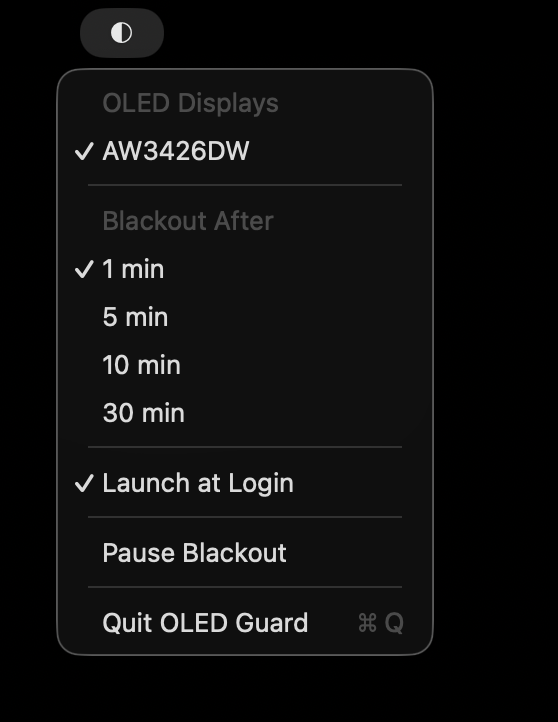

# OLED Guard

A macOS menu bar app that protects an OLED display from burn-in by blacking it out when idle — without interrupting an active meeting.

[](https://github.com/tusharxclaude/oled-protection/actions/workflows/ci.yml)
[](LICENSE)



## Why

OLED panels can develop permanent burn-in from static content left on screen too long. Built-in screen savers and system idle timers don't distinguish "idle" from "faked activity" (e.g. cursor-jiggler apps used to keep a video call alive), and a naive idle timeout would black out the screen mid-meeting. OLED Guard solves both problems: it filters out synthetic input so only real hardware activity resets the idle clock, and it recognizes when a meeting's mic is active so blackout never interrupts a call.

## Features

- **Idle blackout** — after a configurable idle threshold, blacks out your selected OLED display(s) with true black (zero photon emission), dismissed instantly by any real keyboard/mouse input or the Escape key.
- **Meeting exemption** — suppresses blackout while your default input device is actively captured (a proxy for "in a call"), so it won't fire mid-meeting even if you're not typing.
- **Real-input filtering** — distinguishes genuine hardware input from synthetic/injected events (e.g. cursor-jiggler utilities), so those tools can't defeat the protection they're meant to bypass.
- **Per-display selection** — choose which displays get blackout protection; multi-monitor setups with a mix of OLED and non-OLED panels are supported.
- **Blackout Pause** — a manual override to suspend protection for a set time (auto-expires so it can't be left off forever) or resume it early.
- **Launch at login**, configurable idle thresholds, and a menu bar status item — no Dock icon.

See [SPEC.md](SPEC.md) for the full design spec (including cut/future ideas) and [CONTEXT.md](CONTEXT.md) for the project's domain vocabulary.

## Install

Download the latest build from [Releases](https://github.com/tusharxclaude/oled-protection/releases), unzip, and move `OLEDGuard.app` to `/Applications`.

The app is ad-hoc signed (not notarized), so macOS Gatekeeper will block the first launch — right-click the app and choose **Open** to bypass this once.

On first launch, OLED Guard needs **Input Monitoring** permission to detect real keyboard/mouse activity (this is what lets it tell your actual input apart from a synthetic cursor-jiggler). Grant it in **System Settings → Privacy & Security → Input Monitoring**, then relaunch.

## Build from source

Requires macOS 13+ and Xcode (Swift toolchain).

```bash
git clone https://github.com/tusharxclaude/oled-protection.git
cd oled-protection/OLEDGuard
./build.sh
```

This produces `OLEDGuard.app` in that directory, ad-hoc signed and ready to run.

## Development

```bash
cd OLEDGuard
swift build   # build
swift test    # run the test suite
```

## Contributing

See [CONTRIBUTING.md](CONTRIBUTING.md).

## Security

See [SECURITY.md](SECURITY.md) for how to report a vulnerability.

## License

[MIT](LICENSE)
